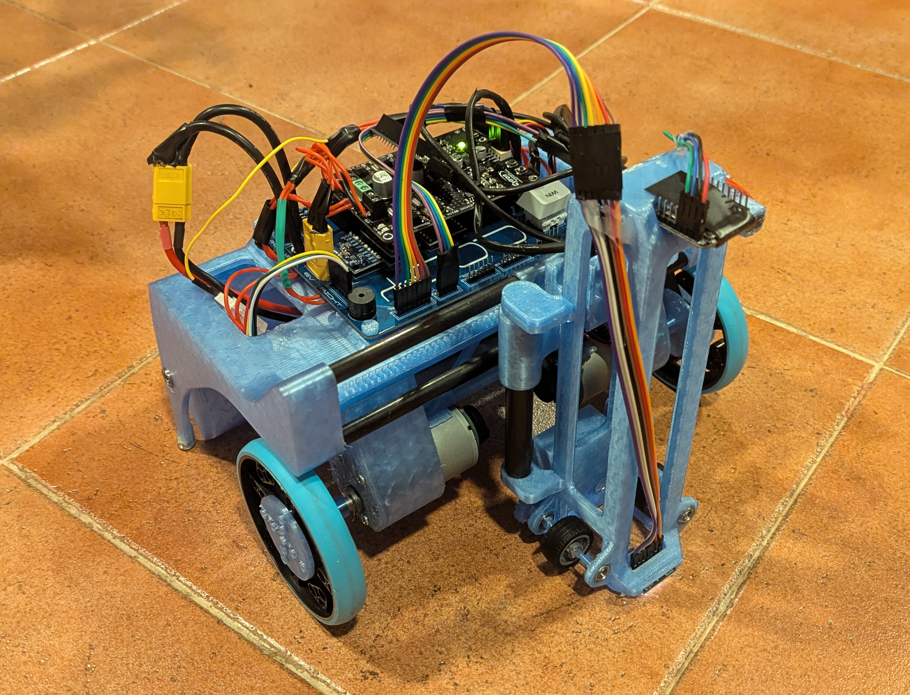
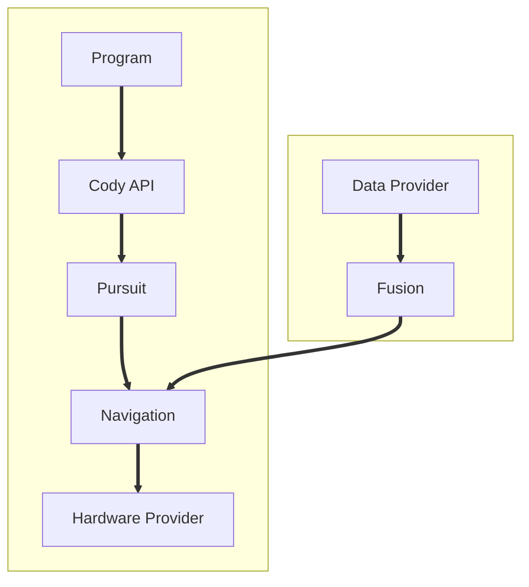

# Cody Firmware

**[Cody](https://github.com/Mikuel210/Cody) is my robot for WRO RoboMission Senior. This project is the firmware that makes it work.**

## About

The World Robot Olympiad (WRO) is a global robotics competition. For the Robomission challenge, you have to design, build and program a robot to complete a set of challenges on a board in under 2 minutes. Cody is our robot for this year, and this project is the firmware that makes it all work. It controls the flow from sensor data to hardware outputs in order to make the robot follow a set of instructions and complete the missions on the board.

## Main features

- **Odometry:** The robot uses the encoders of its wheels in order to constantly update its estimation of its position and orientation, as well as the position of its other motors and attachments.
- **Pure Pursuit:** The robot uses a Pure Pursuit algorithm that allows you to program the robot by defining paths through a set of points. Instead of stopping on each turn like our previous robots did, this algorithm allows the robot to follow paths smoothly.
- **Simulation:** Data and hardware providers are modules you can swap. You can use this capability to accurately test the robot in a simulation. I made a [Unity simulation](https://github.com/Mikuel210/CodySimulation) for this purpose and it allowed us to test the code before the robot was fully built.

## How it works

1. The robot gets data from its sensors
2. The robot fuses the data to estimate its position and orientation
3. The robot uses a Pure Pursuit algorithm to update its navigation target in order to follow a path
4. Navigation generates the signals to be sent to the motors in order to reach the target
5. The navigation output is passed into the hardware provider to move the motors, closing the loop

## Control loop

## Demo video

https://youtu.be/BER6AlDMYd0

## About AI usage

Almost all of the code was written by me, except for:

- [The library for using the TCS34725 color sensor](https://github.com/Mikuel210/TCS_Clone) is vibecoded, as it was a cheap AliExpress clone and it didn't work with any of the existing libraries. It isn't in the repo nor did I track it with Hackatime, but it's required for the robot to work properly.
- I used AI to help me write the `Pursuit::findLookaheadTime` and `Fusion::rgbToColor` functions.

No AI was used to write this README.

> [!NOTE]
> I didn't submit this project to any other YSWS. It might appear like so because I started working on the `Cody` Hackatime project, which I previously used for submitting the robot itself to Blueprint. Early commit history for the firmware is on the main [Cody](https://github.com/Mikuel210/Cody) repo too.

---

Made with ❤️ for [Horizons](horizons.hackclub.com) thanks to [Hack Club](https://hackclub.com)