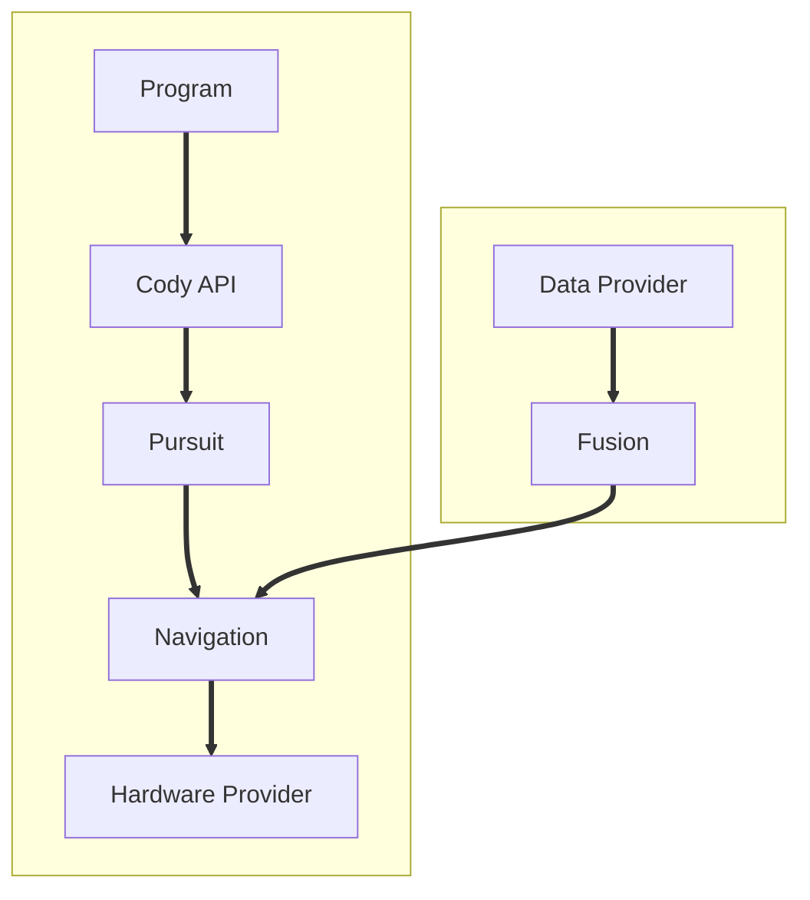

# Cody Firmware

[Cody](https://github.com/Mikuel210/Cody) is my robot for WRO RoboMission Senior. This project is the firmware that makes it all work.

## Main Features

- **Odometry:** The robot uses the encoders of its wheels in order to constantly update its estimation of its position and orientation, as well as the position of its other motors and attachments.
- **Pure Pursuit:** The robot uses a Pure Pursuit algorithm that allows you to program the robot by defining paths through a set of points. Instead of stopping on each turn like our previous robots did, this algorithm allows the robot to follow paths smoothly.
- **Simulation:** Data and hardware providers are modules you can swap. You can use this capability to accurately test the robot in a simulation. I made a [Unity simulation](https://github.com/Mikuel210/CodySimulation) for this purpose and it allowed us to test the code before the robot was fully built.

## How it Works

1. The robot gets data from its sensors
2. The robot fuses the data to estimate its position and orientation
3. The robot uses a Pure Pursuit algorithm to update its navigation target in order to follow a path
4. Navigation generates the signals to be sent to the motors in order to reach the target
5. The navigation output is passed into the hardware provider to move the motors, closing the loop

## Control Loop

## Demo Video

https://youtu.be/BER6AlDMYd0

---

> [!NOTE]
> Some of the commit history for the firmware is in the [Cody](https://github.com/Mikuel210/Cody) repo

Made with ❤️ for [Horizons](horizons.hackclub.com) thanks to [Hack Club](https://hackclub.com)