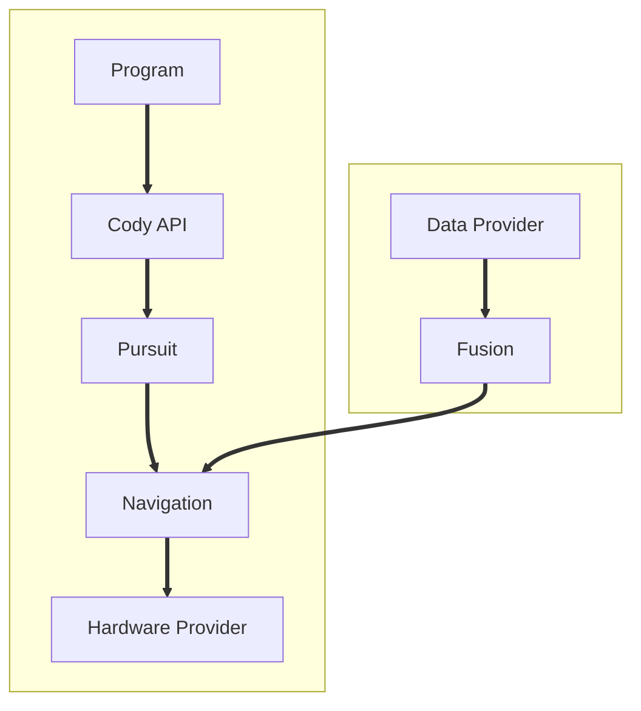

# Cody Firmware

[Cody](https://github.com/Mikuel210/Cody) is my robot for WRO RoboMission Senior. This project is the firmware that makes it all work.

TODO image

## Features

- **Odometry:** 
- Simulation

## How it works

1. The robot gets data from its sensors
2. The robot fuses the data to estimate its position and orientation (this is called **odometry**)
3. The robot uses a **Pure Pursuit** algorithm to follow a path and constantly update its navigation target
4. The navigation output is passed into the hardware provider to move the motors, closing the loop

## Control Loop

## Demo Video

